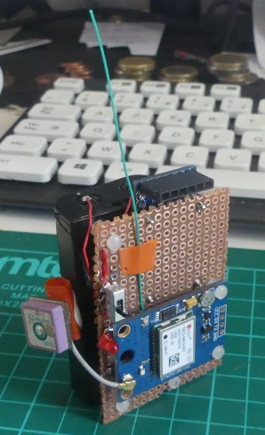
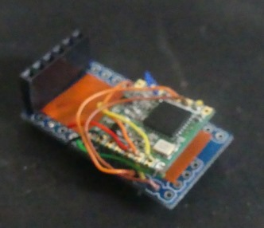
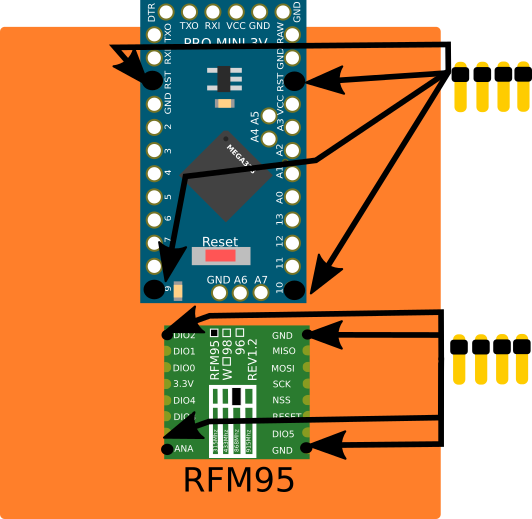
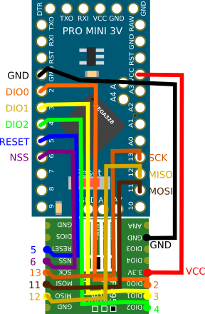

Créer un node LoRa Arduino Mini Pro 3V/RFM95.
----
Voici comment j'ai créé mon premier node LoRa !

Ce node a été pensé pour être petit et modulaire.
En effet, la partie radio/microcontrôleurs est séparée de la partie composants afin de pouvoir facilement ajouter des capteurs.

* Tout d'abord, nous allons voir la **liste des composants** que j'ai utilisés
* Puis nous verrons comment j'ai disposé mes **composants** sur une **stripboard**
* Ensuite j'expliquerais comment j'ai **soudé** le **module radio** à l'arduino
* Et pour finir, j'ajouterais des **piles AA** pour rendre notre Node portable.

> Comme vous pouvez le voir sur la photo, je compte rajouter **un GPS** pour faire des tests de portée.

Une photo de la v1

# Liste du matériel
Pour mon premier node, j'ai utilisé les composants que j'avais à ma disposition.
* Arduino Mini Pro 3V 2.30$
* Module RFM95 4.95$
* Boitier pour 2 piles AA 0.52$

Matériels
* Vis en plastiques
* Stripboard (double face)
* Cables (Wire Wrapping Cable AWG30)
* Broches mâles/femelles

Optionnels
* Interrupteur ON/OFF
* Led/Résistance

Prix : +- 7€

> À noter qu'il est plus simple de partir d'une plateforme avec un module radio intégré comme le Lora32u4, pour 5€ de plus.

# Montage
Maintenant que nous avons vu les composants, je vais vous montrer comment je les ai placés sur ma stripboard pour économiser de l'espace.    

Le module RFM95 ne peut pas être soudé sur la stripboard, j'ai donc décidé de souder uniquement les 4 broches les plus éloignées pour le maintenir en place.
J'ai fait de même avec l'arduino.

> * Idéalement on aurait pu visser les composants à la stripboard mais, il n'y a pas de vis sur l'arduino ni le RFM95.
> * J'ai retourné le module radio pour pouvoir facilement lire le nom des broches 

Notre module radio et notre arduino sont maintenant solidement attachés à la stripboard, nous allons pouvoir les relier à l'aide de câbles.

# Soudure module Radio / Arduino
Afin de relier l'arduino au RFM95, j'ai coupé des câbles longs.
Puis j'ai coupé les câbles à la bonne longueur pour les relier au RFM95
> - Garder toujours un peu de marge pour pouvoir bouger les câbles
> - J'aurais du utiliser une stripboard double face pour m'éviter de me prendre la tête, ultérieurement.

Voilà une photo du résultat.

Et un schéma de câblage.

* DIO0 - 2  - Orange
* DIO1 - 3  - Jaune
* DIO2 - 4  - Vert
* RST  - 5  - Bleu
* NSS  - 6  - Violet
* SCK  - 13 - Orange
* MISO - 12 - Jaune
* MOSI - 11 - Marron

> * Prenez le temps de vérifier à l'aide d'un multimètre les connexions 
> * Je ne l'ai pas encore fait, mais couper les excédents de câbles au-dessous des composants pour éviter les faux contacts (voir photo suivante)

Voilà mon module radio est soudé, vous pouvez en rester là si vous comptez alimenter votre arduino en USB, sinon nous allons voir comment j'ai alimenté mon node avec deux piles AA.

> Vous pouvez ajouter une antenne faite avec un câble de 8,2cm (pour le 868mhz européen) sur la broche ANA pour améliorer la portée.

# Ajout des piles.
Pour ajouter les piles, j'ai utilisé un boitier que j'ai fixé à l'aide de vis en plastiques.
Vous pouvez faire des trous pour les vis avec un drémel, personnellement je me suis contenté de le faire avec un couteau, vu que ma stripboard est facile à percer.

Le boitier de piles se pose au-dessus de l'arduino et du module radio, il n'est pas très solidement fixé mais peut du coup se retirer facilement.

> J'ai remplacé (difficilement) les câbles du boitier de piles avec mes câbles.

# Conclusion
Voilà comment j'ai créé mon premier node.
Si vous ne cherchez pas à économiser quelques euros, je vous conseille quand même d'utiliser une plateforme avec un module LoRa intégré.

Le boitier de pile permet de poser le node et vous avez toute la surface avant pour ajouter de nouveaux composants.
J'ai pour le moment ajouté une LED et un interrupteur (pour le boitier de piles).