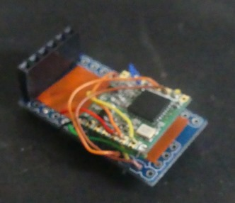

Créer un appareil LoRa.
----


Un appareil (node) LoRa est capable d'émettre des messages radio et d'en recevoir du moment qu'il est proche 
d'une passerelle LoRa.
Voici comment fabriquer un appareil capable de parler à une passerelle (gateway) LoRa relié à The Thing Network.

J'ai réussi à transmettre des données sur 1km à peu près.

# Création du compte
Pour exploiter le réseau TTN il faut avoir un compte sur le site https://www.thethingsnetwork.org

## Créer une application
Aller dans la console pour créer une application.
https://console.thethingsnetwork.org/

* Cliquer sur Add Application.
* Choissisez un nom dans *Application ID*
* Le reste est prérempli.

## Créer un appareil (device)
Dans votre application, onglet ** Devices **.

* Cliquez sur *register device*
* Choissisez un nom dans *Device ID*
* Cliquer sur les flèches pour générer automatiquement le *Device EUI*
* Le reste est prérempli.

## Mettre en mode ABP.
Dans le *device overview*, vous avez toutes les informations nécessaires pour programmer votre plateforme.
Il nous reste à paramétrer notre device en ABP. (Je n'ai pas testé le programme ttn-otaa).

* Dans Settings
* Changer Activation Method sur **ABP**

# Choix du Module Radio
Il faut que notre microcontroleur soit connecté en SPI à un module radio compatible **SemTech SX1276**.    
C'est le cas par example des modules **RFM95**.   
Je pense faire mes prochains node sur une base de **Lora32u4** similaire au **Adafruit Feather 32u4 RFM95 LoRa Radio**.

# Test Arduino Mini Pro 3v / RFM95
N'ayant pas à ma disposition de plateforme avec module radio intégré, j'ai décidé de faire mes essais avec un **Arduino Mini Pro 3V** et un module **RFM95**.

## Branchement
* NSS  - 6  - Violet
* RST  - 5  - Bleu
* DIO0 - 2  - Orange
* DIO1 - 3  - Jaune
* DIO2 - 4  - Vert
* MOSI - 11 - Marron
* MISO - 12 - Jaune
* SCK  - 13 - Orange

Je suis parti de ce tutoriel pour essayer de créer un node.
https://www.thethingsnetwork.org/labs/story/using-adafruit-feather-32u4-rfm95-as-an-ttn-node   

Le README précise que la bibliothèque (libraries) est compatible avec les puces AVR.    
https://github.com/matthijskooijman/arduino-lmic   
Il est possible de télécharger directement la bibliothèque dans le logiciel Arduino en cherchant **IBM LMIC**

## Examples/ttn-abp

J'ai utilisé le programme **examples/ttn-abp.ino**.

Il faut changer les trois premières constantes dans le programme.   
Vous pouvez les trouver dans le **Device Overview**, cliquer sur les crochets pour afficher les valeurs pour le programme.
```
//Network Session Key
static const PROGMEM u1_t NWKSKEY[16] = { 0xC9, 0x58, 0xE7, 0xED, 0x02, 0xBE, 0x68, 0x18, 0xC1, 0x95, 0xCB, 0x6B, 0x6C, 0x34, 0x34, 0x12 };   
//App Session Key
static const u1_t PROGMEM APPSKEY[16] = { 0xD4, 0x12, 0x7B, 0xD8, 0xF1, 0x82, 0x74, 0x05, 0xF9, 0xBA, 0x22, 0xF6, 0x60, 0x55, 0x1C, 0x61 };   
// Device Address 0xDeviceAddress
static const u4_t DEVADDR = 0x260110B8;   
```

Dans Data vous devriez recevoir des données.


